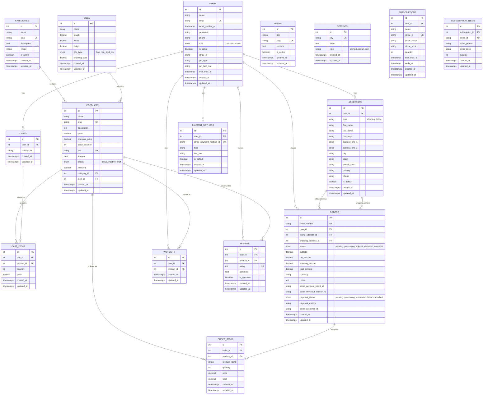

# Database Entities Documentation

## USERS
Stores information about all system users including customers and administrators. Enhanced with Laravel Cashier (Stripe) billing capabilities.

**Purpose**: Manages user authentication, authorization, basic profile information, and Stripe customer integration.

**Key Fields**:
- `role`: Differentiates between customers and admins
- `email_verified_at`: Ensures email validation before full access
- `is_active`: Allows soft deactivation of accounts
- `stripe_id`: Stripe customer ID for payment processing
- `pm_type`: Default payment method type
- `pm_last_four`: Last four digits of default payment method
- `trial_ends_at`: Trial period end date (reserved for future use)

**Examples**:
1. **Customer User**:
   ```
   id: 1
   name: "John Smith"
   email: "john.smith@example.com"
   role: "customer"
   is_active: true
   phone: "+1234567890"
   stripe_id: "cus_1234567890"
   pm_type: "card"
   pm_last_four: "4242"
   trial_ends_at: null
   ```

2. **Admin User**:
   ```
   id: 2
   name: "Sarah Admin"
   email: "admin@mystore.com"
   role: "admin"
   is_active: true
   phone: "+1987654321"
   stripe_id: null
   pm_type: null
   pm_last_four: null
   trial_ends_at: null
   ```

---

## CATEGORIES
Organizes products into logical groups for easier navigation and filtering.

**Purpose**: Provides product categorization for browsing and organization.

**Key Fields**:
- `slug`: SEO-friendly URL identifier
- `is_active`: Controls category visibility on frontend

**Examples**:
1. **Electronics Category**:
   ```
   id: 1
   name: "Electronics"
   slug: "electronics"
   description: "Phones, laptops, and electronic accessories"
   image: "/images/categories/electronics.jpg"
   is_active: true
   ```

2. **Clothing Category**:
   ```
   id: 2
   name: "Clothing"
   slug: "clothing"
   description: "Men's and women's apparel"
   image: "/images/categories/clothing.jpg"
   is_active: true
   ```

---

## SIZES
Defines physical dimensions and shipping properties for products.

**Purpose**: Manages product dimensions for shipping cost calculations and logistics planning.

**Key Fields**:
- `name`: Human-readable identifier for easy recognition
- `length`, `width`, `height`: Physical dimensions in centimeters
- `box_type`: Packaging requirements (rigid box vs flexible packaging)
- `shipping_cost`: Base shipping cost for this size category

**Examples**:
1. **Small Electronics Size**:
   ```
   id: 1
   name: "Small Electronics"
   length: 15.0
   width: 10.0
   height: 5.0
   box_type: "box"
   shipping_cost: 8.99
   ```

2. **Large Clothing Size**:
   ```
   id: 2
   name: "Large Apparel"
   length: 35.0
   width: 25.0
   height: 8.0
   box_type: "non_rigid_box"
   shipping_cost: 12.50
   ```

---

## PRODUCTS
The core entity storing all product information and inventory details.

**Purpose**: Manages product catalog with pricing, inventory, and metadata.

**Key Fields**:
- `compare_price`: Original price for discount display
- `sku`: Unique product identifier for inventory management
- `images`: JSON array of product image URLs
- `featured`: Highlights products on homepage
- `size_id`: Links to shipping dimensions and costs

**Relationship**: Each product belongs to one category and has one size specification.

**Examples**:
1. **Smartphone Product**:
   ```
   id: 1
   name: "iPhone 15 Pro"
   slug: "iphone-15-pro"
   description: "Latest iPhone with advanced camera system"
   price: 999.99
   compare_price: 1099.99
   stock_quantity: 25
   sku: "IP15P-128GB-BLK"
   images: ["img1.jpg", "img2.jpg", "img3.jpg"]
   status: "active"
   featured: true
   category_id: 1
   size_id: 1
   ```

2. **T-Shirt Product**:
   ```
   id: 2
   name: "Cotton Basic T-Shirt"
   slug: "cotton-basic-tshirt"
   description: "Comfortable 100% cotton t-shirt"
   price: 24.99
   compare_price: null
   stock_quantity: 150
   sku: "TSHIRT-COT-MED-BLU"
   images: ["tshirt1.jpg", "tshirt2.jpg"]
   status: "active"
   featured: false
   category_id: 2
   size_id: 2
   ```

---

## ADDRESSES
Stores customer shipping and billing addresses for checkout and delivery.

**Purpose**: Manages customer addresses for order fulfillment and billing.

**Key Fields**:
- `type`: Differentiates between shipping and billing addresses
- `is_default`: Marks primary address for quick checkout

**Relationship**: Each user can have multiple addresses, each order references specific billing and shipping addresses.

**Examples**:
1. **Shipping Address**:
   ```
   id: 1
   user_id: 1
   type: "shipping"
   first_name: "John"
   last_name: "Smith"
   company: null
   address_line_1: "123 Main Street"
   address_line_2: "Apt 4B"
   city: "New York"
   state: "NY"
   postal_code: "10001"
   country: "USA"
   phone: "+1234567890"
   is_default: true
   ```

2. **Billing Address**:
   ```
   id: 2
   user_id: 1
   type: "billing"
   first_name: "John"
   last_name: "Smith"
   company: "Tech Corp"
   address_line_1: "456 Business Ave"
   address_line_2: "Suite 200"
   city: "Boston"
   state: "MA"
   postal_code: "02101"
   country: "USA"
   phone: "+1234567890"
   is_default: true
   ```

---

## CARTS
Temporary storage for products users intend to purchase.

**Purpose**: Manages shopping cart functionality for both logged-in users and guests.

**Key Fields**:
- `user_id`: Links cart to registered user (null for guests)
- `session_id`: Identifies guest carts by browser session

**Examples**:
1. **Registered User Cart**:
   ```
   id: 1
   user_id: 1
   session_id: null
   ```

2. **Guest User Cart**:
   ```
   id: 2
   user_id: null
   session_id: "sess_abc123def456"
   ```

---

## CART_ITEMS
Individual products added to shopping carts with quantities and pricing.

**Purpose**: Stores specific products and quantities in each cart.

**Key Fields**:
- `price`: Captures price at time of adding (for price change protection)
- `quantity`: Number of items

**Relationship**: Each cart can have multiple cart items, each cart item belongs to one cart and references one product.

**Examples**:
1. **iPhone in Cart**:
   ```
   id: 1
   cart_id: 1
   product_id: 1
   quantity: 1
   price: 999.99
   ```

2. **Multiple T-Shirts in Cart**:
   ```
   id: 2
   cart_id: 1
   product_id: 2
   quantity: 3
   price: 24.99
   ```

---

## ORDERS
Completed purchase transactions with customer, payment information, and Stripe integration.

**Purpose**: Records finalized purchases with all transaction details and payment processing status.

**Key Fields**:
- `order_number`: Unique identifier for customer reference
- `status`: Tracks order fulfillment progress
- `billing_address_id`/`shipping_address_id`: Foreign keys to specific address records
- `shipping_amount`: Calculated based on product sizes and destination
- `stripe_payment_intent_id`: Stripe Payment Intent ID for tracking payments
- `stripe_checkout_session_id`: Stripe Checkout Session ID for session-based payments
- `payment_status`: Payment processing status (pending, processing, succeeded, failed, cancelled)
- `payment_method`: Payment method used (card, bank_transfer, etc.)
- `stripe_customer_id`: Stripe customer ID for the transaction

**Relationship**: Each order belongs to one user and references specific billing and shipping addresses.

**Examples**:
1. **Completed Order**:
   ```
   id: 1
   order_number: "ORD-2024-001"
   user_id: 1
   billing_address_id: 2
   shipping_address_id: 1
   status: "delivered"
   subtotal: 1024.98
   tax_amount: 82.00
   shipping_amount: 15.00
   total_amount: 1121.98
   currency: "USD"
   notes: "Leave at front door"
   stripe_payment_intent_id: "pi_1234567890"
   stripe_checkout_session_id: "cs_1234567890"
   payment_status: "succeeded"
   payment_method: "card"
   stripe_customer_id: "cus_1234567890"
   ```

2. **Processing Order**:
   ```
   id: 2
   order_number: "ORD-2024-002"
   user_id: 1
   billing_address_id: 2
   shipping_address_id: 1
   status: "processing"
   subtotal: 74.97
   tax_amount: 6.00
   shipping_amount: 12.50
   total_amount: 93.47
   currency: "USD"
   notes: null
   stripe_payment_intent_id: "pi_0987654321"
   stripe_checkout_session_id: null
   payment_status: "processing"
   payment_method: "card"
   stripe_customer_id: "cus_1234567890"
   ```

---

## ORDER_ITEMS
Individual products within completed orders with historical pricing.

**Purpose**: Records exactly what was purchased in each order with prices at purchase time.

**Key Fields**:
- `product_name`: Snapshot of product name (in case product is deleted/renamed)
- `price`: Price paid per item
- `total`: Price × quantity

**Relationship**: Each order contains multiple order items, each item references the original product.

**Examples**:
1. **iPhone Order Item**:
   ```
   id: 1
   order_id: 1
   product_id: 1
   product_name: "iPhone 15 Pro"
   quantity: 1
   price: 999.99
   total: 999.99
   ```

2. **T-Shirt Order Item**:
   ```
   id: 2
   order_id: 1
   product_id: 2
   product_name: "Cotton Basic T-Shirt"
   quantity: 3
   price: 24.99
   total: 74.97
   ```

---

## WISHLISTS
Products saved by customers for future purchase consideration.

**Purpose**: Allows customers to save products they're interested in buying later.

**Relationship**: Many-to-many relationship between users and products through wishlist entries.

**Examples**:
1. **Wishlist Entry 1**:
   ```
   id: 1
   user_id: 1
   product_id: 5
   ```

2. **Wishlist Entry 2**:
   ```
   id: 2
   user_id: 1
   product_id: 8
   ```

---

## REVIEWS
Customer feedback and ratings for purchased products.

**Purpose**: Builds trust through social proof and helps other customers make decisions.

**Key Fields**:
- `rating`: 1-5 star rating system
- `is_approved`: Allows moderation of reviews before publication

**Relationship**: Each review belongs to one user and one product.

**Examples**:
1. **Positive Review**:
   ```
   id: 1
   user_id: 1
   product_id: 1
   rating: 5
   comment: "Excellent phone, camera quality is amazing!"
   is_approved: true
   ```

2. **Moderate Review**:
   ```
   id: 2
   user_id: 1
   product_id: 2
   rating: 3
   comment: "Good quality shirt but runs small. Order one size up."
   is_approved: true
   ```

---

## PAGES
CMS functionality for managing static content pages.

**Purpose**: Allows admins to create and edit website content without developer involvement.

**Key Fields**:
- `slug`: SEO-friendly URL
- `content`: Rich text content (HTML)
- `is_active`: Controls page visibility

**Examples**:
1. **About Us Page**:
   ```
   id: 1
   title: "About Us"
   slug: "about"
   content: "<h1>About Our Company</h1><p>We are a leading retailer...</p>"
   is_active: true
   ```

2. **Privacy Policy Page**:
   ```
   id: 2
   title: "Privacy Policy"
   slug: "privacy"
   content: "<h1>Privacy Policy</h1><p>This policy describes how we collect...</p>"
   is_active: true
   ```

---

## SETTINGS
Dynamic configuration values that can be modified through admin panel.

**Purpose**: Stores site-wide settings and configuration without requiring code changes.

**Key Fields**:
- `key`: Unique identifier for each setting
- `value`: The setting value (can be string, JSON, etc.)
- `type`: Data type for proper parsing

**Examples**:
1. **Site Configuration**:
   ```
   id: 1
   key: "site_name"
   value: "MyStore Ecommerce"
   type: "string"
   ```

2. **Payment Settings**:
   ```
   id: 2
   key: "stripe_settings"
   value: '{"public_key": "pk_test_...", "webhook_secret": "whsec_..."}'
   type: "json"
   ```

---

## PAYMENT_METHODS (Future Enhancement)
Stores saved payment methods for customers (reserved for future implementation).

**Purpose**: Manages saved payment methods for faster checkout.

**Key Fields**:
- `user_id`: Links payment method to customer
- `stripe_payment_method_id`: Stripe payment method ID
- `type`: Payment method type (card, bank_account, etc.)
- `last_four`: Last four digits for display
- `is_default`: Whether this is the default payment method

**Examples**:
1. **Saved Card**:
   ```
   id: 1
   user_id: 1
   stripe_payment_method_id: "pm_1234567890"
   type: "card"
   last_four: "4242"
   is_default: true
   ```

---

## ER Scheme

