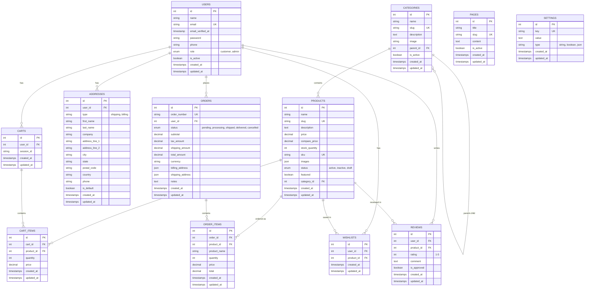

```mermaid
erDiagram
    USERS {
        int id PK
        string name
        string email UK
        timestamp email_verified_at
        string password
        string phone
        enum role "customer, admin"
        boolean is_active
        timestamps created_at
        timestamps updated_at
    }

    CATEGORIES {
        int id PK
        string name
        string slug UK
        text description
        string image
        int parent_id FK
        boolean is_active
        timestamps created_at
        timestamps updated_at
    }

    PRODUCTS {
        int id PK
        string name
        string slug UK
        text description
        decimal price
        decimal compare_price
        int stock_quantity
        string sku UK
        json images
        enum status "active, inactive, draft"
        boolean featured
        int category_id FK
        timestamps created_at
        timestamps updated_at
    }

    ADDRESSES {
        int id PK
        int user_id FK
        string type "shipping, billing"
        string first_name
        string last_name
        string company
        string address_line_1
        string address_line_2
        string city
        string state
        string postal_code
        string country
        string phone
        boolean is_default
        timestamps created_at
        timestamps updated_at
    }

    CARTS {
        int id PK
        int user_id FK
        string session_id
        timestamps created_at
        timestamps updated_at
    }

    CART_ITEMS {
        int id PK
        int cart_id FK
        int product_id FK
        int quantity
        decimal price
        timestamps created_at
        timestamps updated_at
    }

    ORDERS {
        int id PK
        string order_number UK
        int user_id FK
        enum status "pending, processing, shipped, delivered, cancelled"
        decimal subtotal
        decimal tax_amount
        decimal shipping_amount  
        decimal total_amount
        string currency
        json billing_address
        json shipping_address
        text notes
        timestamps created_at
        timestamps updated_at
    }

    ORDER_ITEMS {
        int id PK
        int order_id FK
        int product_id FK
        string product_name
        int quantity
        decimal price
        decimal total
        timestamps created_at
        timestamps updated_at
    }

    WISHLISTS {
        int id PK
        int user_id FK
        int product_id FK
        timestamps created_at
        timestamps updated_at
    }

    REVIEWS {
        int id PK
        int user_id FK
        int product_id FK
        int rating "1-5"
        text comment
        boolean is_approved
        timestamps created_at
        timestamps updated_at
    }

    PAGES {
        int id PK
        string title
        string slug UK
        text content
        boolean is_active
        timestamps created_at
        timestamps updated_at
    }

    SETTINGS {
        int id PK
        string key UK
        text value
        string type "string, boolean, json"
        timestamps created_at
        timestamps updated_at
    }

    %% Relationships
    USERS ||--o{ ADDRESSES : has
    USERS ||--o{ CARTS : has
    USERS ||--o{ ORDERS : places
    USERS ||--o{ WISHLISTS : has
    USERS ||--o{ REVIEWS : writes

    CATEGORIES ||--o{ CATEGORIES : "parent-child"
    CATEGORIES ||--o{ PRODUCTS : contains

    PRODUCTS ||--o{ CART_ITEMS : "added to"
    PRODUCTS ||--o{ ORDER_ITEMS : "ordered as"
    PRODUCTS ||--o{ WISHLISTS : "saved in"
    PRODUCTS ||--o{ REVIEWS : "reviewed in"

    CARTS ||--o{ CART_ITEMS : contains
    ORDERS ||--o{ ORDER_ITEMS : contains

```