# Database Entities Documentation

## USERS
Stores information about all system users including customers and administrators. Enhanced with Laravel Cashier (Stripe) billing capabilities.

**Purpose**: Manages user authentication, authorization, basic profile information, and Stripe customer integration. Users are only created after email verification to ensure valid email addresses.

**Key Fields**:
- `role`: Differentiates between customers and admins (ENUM: 'customer', 'admin', default 'customer')
- `email_verified_at`: **MANDATORY** - Users are only created after email verification (NOT NULL for all users except Google auth)
- `is_active`: Allows soft deactivation of accounts (TINYINT(1) NOT NULL DEFAULT '1')
- `stripe_id`: Stripe customer ID for payment processing (indexed)
- `pm_type`: Default payment method type
- `pm_last_four`: Last four digits of default payment method (VARCHAR(4))
- `trial_ends_at`: Trial period end date (reserved for future use)
- `remember_token`: Laravel's "remember me" functionality (VARCHAR(100))
- `google_id`: Google account ID for OAuth authentication (VARCHAR(255) NULL)
- `avatar`: User avatar URL (VARCHAR(255) NULL)

**Examples**:
1. **Customer User** (Verified via email):
   ```
   id: 1
   name: "John Smith"
   email: "john.smith@example.com"
   email_verified_at: "2024-08-12 10:30:00"
   role: "customer"
   is_active: true
   phone: "+1234567890"
   google_id: null
   avatar: null
   stripe_id: "cus_1234567890"
   pm_type: "card"
   pm_last_four: "4242"
   trial_ends_at: null
   remember_token: "1a2b3c4d5e6f7g8h9i0j"
   ```

2. **Google Auth User** (Auto-verified):
   ```
   id: 2
   name: "Jane Doe"
   email: "jane.doe@gmail.com"
   email_verified_at: "2024-08-12 11:45:00"
   role: "customer"
   is_active: true
   phone: null
   google_id: "google_123456789"
   avatar: "https://lh3.googleusercontent.com/..."
   stripe_id: null
   pm_type: null
   pm_last_four: null
   trial_ends_at: null
   remember_token: null
   ```

3. **Admin User**:
   ```
   id: 3
   name: "Sarah Admin"
   email: "admin@mystore.com"
   email_verified_at: "2024-08-12 09:00:00"
   role: "admin"
   is_active: true
   phone: "+1987654321"
   google_id: null
   avatar: null
   stripe_id: null
   pm_type: null
   pm_last_four: null
   trial_ends_at: null
   remember_token: null
   ```

---

## PENDING_USER_VERIFICATIONS
Temporary storage for user registration data before email verification. This table ensures users are not created in the main users table until they verify their email address.

**Purpose**: Manages the email verification process during user registration, preventing database pollution from unverified accounts.

**Key Fields**:
- `name`: User's full name from registration
- `email`: Email address to be verified (unique constraint)
- `password`: Hashed password from registration
- `verification_token`: Unique 64-character token for verification (unique constraint)
- `token_expires_at`: Expiration timestamp (24 hours from creation)

**Security Features**:
- Tokens expire after 24 hours
- Unique verification tokens prevent replay attacks
- Automatic cleanup of expired records
- Rate limiting on resend attempts

**Workflow**:
1. User submits registration form
2. Record created in pending_user_verifications
3. Verification email sent with signed URL
4. User clicks verification link
5. Verified user record created in users table
6. Pending verification record deleted

**Examples**:
1. **Active Pending Verification**:
   ```
   id: 1
   name: "John Smith"
   email: "john.smith@example.com"
   password: "$2y$12$..." (bcrypt hash)
   verification_token: "abc123def456ghi789jkl012mno345pqr678stu901vwx234yzA567BCD"
   token_expires_at: "2024-08-13 14:30:00"
   created_at: "2024-08-12 14:30:00"
   updated_at: "2024-08-12 14:30:00"
   ```

2. **Expired Pending Verification** (will be cleaned up):
   ```
   id: 2
   name: "Jane Doe"
   email: "jane.doe@example.com"
   password: "$2y$12$..." (bcrypt hash)
   verification_token: "def456ghi789jkl012mno345pqr678stu901vwx234yzA567BCDabc123"
   token_expires_at: "2024-08-11 10:15:00" (expired)
   created_at: "2024-08-10 10:15:00"
   updated_at: "2024-08-10 10:15:00"
   ```

**Constraints**:
- Unique constraint on email (prevents duplicate pending registrations)
- Unique constraint on verification_token (ensures token uniqueness)
- Foreign key constraints prevent conflicts with existing users

**Maintenance**:
- Daily automatic cleanup of expired records at 3:00 AM
- Manual cleanup available via `php artisan auth:cleanup-pending`
- Status monitoring via `php artisan auth:pending-status`

---

## CATEGORIES
Organizes products into logical groups for easier navigation and filtering.

**Purpose**: Provides product categorization for browsing and organization.

**Key Fields**:
- `slug`: SEO-friendly URL identifier (unique)
- `is_active`: Controls category visibility on frontend (TINYINT(1) NOT NULL DEFAULT '1')
- `sort_order`: Controls the display order of categories (INT NOT NULL DEFAULT '0')

**Examples**:
1. **Electronics Category**:
   ```
   id: 1
   name: "Electronics"
   slug: "electronics"
   description: "Phones, laptops, and electronic accessories"
   image: "/images/categories/electronics.jpg"
   is_active: true
   sort_order: 1
   ```

2. **Clothing Category**:
   ```
   id: 2
   name: "Clothing"
   slug: "clothing"
   description: "Men's and women's apparel"
   image: "/images/categories/clothing.jpg"
   is_active: true
   sort_order: 2
   ```

---

## SIZES
Defines physical dimensions and shipping properties for products.

**Purpose**: Manages product dimensions for shipping cost calculations and logistics planning.

**Key Fields**:
- `name`: Human-readable identifier for easy recognition
- `length`, `width`, `height`: Physical dimensions in centimeters
- `box_type`: Packaging requirements (rigid box vs flexible packaging)
- `shipping_cost`: Base shipping cost for this size category

**Examples**:
1. **Small Electronics Size**:
   ```
   id: 1
   name: "Small Electronics"
   length: 15.0
   width: 10.0
   height: 5.0
   box_type: "box"
   shipping_cost: 8.99
   ```

2. **Large Clothing Size**:
   ```
   id: 2
   name: "Large Apparel"
   length: 35.0
   width: 25.0
   height: 8.0
   box_type: "non_rigid_box"
   shipping_cost: 12.50
   ```

---

## PRODUCTS
The core entity storing all product information and inventory details.

**Purpose**: Manages product catalog with pricing, inventory, and metadata.

**Key Fields**:
- `compare_price`: Original price for discount display
- `sku`: Unique product identifier for inventory management
- `images`: JSON array of product image URLs
- `featured`: Highlights products on homepage
- `size_id`: Links to shipping dimensions and costs

**Relationship**: Each product belongs to one category and has one size specification.

**Examples**:
1. **Smartphone Product**:
   ```
   id: 1
   name: "iPhone 15 Pro"
   slug: "iphone-15-pro"
   description: "Latest iPhone with advanced camera system"
   price: 999.99
   compare_price: 1099.99
   stock_quantity: 25
   sku: "IP15P-128GB-BLK"
   images: ["img1.jpg", "img2.jpg", "img3.jpg"]
   status: "active"
   featured: true
   category_id: 1
   size_id: 1
   ```

2. **T-Shirt Product**:
   ```
   id: 2
   name: "Cotton Basic T-Shirt"
   slug: "cotton-basic-tshirt"
   description: "Comfortable 100% cotton t-shirt"
   price: 24.99
   compare_price: null
   stock_quantity: 150
   sku: "TSHIRT-COT-MED-BLU"
   images: ["tshirt1.jpg", "tshirt2.jpg"]
   status: "active"
   featured: false
   category_id: 2
   size_id: 2
   ```

---

## ADDRESSES
Stores customer shipping and billing addresses for checkout and delivery.

**Purpose**: Manages customer addresses for order fulfillment and billing.

**Key Fields**:
- `type`: Differentiates between shipping and billing addresses
- `is_default`: Marks primary address for quick checkout

**Relationship**: Each user can have multiple addresses, each order references specific billing and shipping addresses.

**Examples**:
1. **Shipping Address**:
   ```
   id: 1
   user_id: 1
   type: "shipping"
   first_name: "John"
   last_name: "Smith"
   company: null
   address_line_1: "123 Main Street"
   address_line_2: "Apt 4B"
   city: "New York"
   state: "NY"
   postal_code: "10001"
   country: "USA"
   phone: "+1234567890"
   is_default: true
   ```

2. **Billing Address**:
   ```
   id: 2
   user_id: 1
   type: "billing"
   first_name: "John"
   last_name: "Smith"
   company: "Tech Corp"
   address_line_1: "456 Business Ave"
   address_line_2: "Suite 200"
   city: "Boston"
   state: "MA"
   postal_code: "02101"
   country: "USA"
   phone: "+1234567890"
   is_default: true
   ```

---

## CARTS
Temporary storage for products users intend to purchase.

**Purpose**: Manages shopping cart functionality for both logged-in users and guests.

**Key Fields**:
- `user_id`: Links cart to registered user (null for guests)
- `session_id`: Identifies guest carts by browser session

**Examples**:
1. **Registered User Cart**:
   ```
   id: 1
   user_id: 1
   session_id: null
   ```

2. **Guest User Cart**:
   ```
   id: 2
   user_id: null
   session_id: "sess_abc123def456"
   ```

---

## CART_ITEMS
Individual products added to shopping carts with quantities and pricing.

**Purpose**: Stores specific products and quantities in each cart.

**Key Fields**:
- `price`: Captures price at time of adding (for price change protection)
- `quantity`: Number of items
- `size_id`: Optional reference to specific size (BIGINT UNSIGNED NULL, foreign key to sizes table)

**Constraints**:
- Unique constraint on `cart_id` and `product_id` combination (prevents duplicate products in same cart)

**Relationship**: Each cart can have multiple cart items, each cart item belongs to one cart and references one product. Cart items can optionally reference a specific size.

**Examples**:
1. **iPhone in Cart**:
   ```
   id: 1
   cart_id: 1
   product_id: 1
   quantity: 1
   price: 999.99
   size_id: 1
   ```

2. **Multiple T-Shirts in Cart**:
   ```
   id: 2
   cart_id: 1
   product_id: 2
   quantity: 3
   price: 24.99
   size_id: 2
   ```

---

## ORDERS
Completed purchase transactions with customer, payment information, and Stripe integration. Supports both registered users and guest checkout.

**Purpose**: Records finalized purchases with all transaction details and payment processing status.

**Key Fields**:
- `order_number`: Unique identifier for customer reference
- `user_id`: Links to registered user (NULL for guest orders)
- `guest_email`: Email for guest orders (VARCHAR(255) NULL)
- `guest_phone`: Phone number for guest orders (VARCHAR(20) NULL)
- `guest_session_id`: Session identifier for guest orders (VARCHAR(255) NULL, indexed)
- `status`: Tracks order fulfillment progress (ENUM: 'pending', 'processing', 'shipped', 'delivered', 'cancelled')
- `billing_address_id`/`shipping_address_id`: Foreign keys to specific address records
- `shipping_amount`: Calculated based on product sizes and destination
- `currency`: Order currency (VARCHAR(3) NOT NULL DEFAULT 'USD')
- `tracking_number`: Shipping tracking number (VARCHAR(255) NULL)
- `stripe_payment_intent_id`: Stripe Payment Intent ID for tracking payments
- `stripe_checkout_session_id`: Stripe Checkout Session ID for session-based payments
- `payment_status`: Payment processing status (ENUM: 'pending', 'processing', 'succeeded', 'failed', 'cancelled')
- `payment_method`: Payment method used (card, bank_transfer, etc.)
- `stripe_customer_id`: Stripe customer ID for the transaction
- `confirmation_email_sent`: Whether confirmation email has been sent (TINYINT(1) NOT NULL DEFAULT '0')
- `confirmation_email_sent_at`: Timestamp when confirmation email was sent

**Relationship**: Each order can belong to a registered user OR be a guest order. Each order references specific billing and shipping addresses.

**Examples**:
1. **Completed Order**:
   ```
   id: 1
   order_number: "ORD-2024-001"
   user_id: 1
   guest_email: null
   guest_phone: null
   guest_session_id: null
   billing_address_id: 2
   shipping_address_id: 1
   status: "delivered"
   subtotal: 1024.98
   tax_amount: 82.00
   shipping_amount: 15.00
   total_amount: 1121.98
   currency: "USD"
   notes: "Leave at front door"
   tracking_number: "1Z999AA1234567890"
   stripe_payment_intent_id: "pi_1234567890"
   stripe_checkout_session_id: "cs_1234567890"
   payment_status: "succeeded"
   payment_method: "card"
   stripe_customer_id: "cus_1234567890"
   confirmation_email_sent: true
   confirmation_email_sent_at: "2024-08-11 14:30:00"
   ```

2. **Processing Order**:
   ```
   id: 2
   order_number: "ORD-2024-002"
   user_id: 1
   guest_email: null
   guest_phone: null
   guest_session_id: null
   billing_address_id: 2
   shipping_address_id: 1
   status: "processing"
   subtotal: 74.97
   tax_amount: 6.00
   shipping_amount: 12.50
   total_amount: 93.47
   currency: "USD"
   notes: null
   tracking_number: null
   stripe_payment_intent_id: "pi_0987654321"
   stripe_checkout_session_id: null
   payment_status: "processing"
   payment_method: "card"
   stripe_customer_id: "cus_1234567890"
   confirmation_email_sent: false
   confirmation_email_sent_at: null
   ```

3. **Guest Order**:
   ```
   id: 3
   order_number: "ORD-2024-003"
   user_id: null
   guest_email: "guest@example.com"
   guest_phone: "+1555123456"
   guest_session_id: "sess_guest_abc123"
   billing_address_id: 3
   shipping_address_id: 3
   status: "pending"
   subtotal: 49.99
   tax_amount: 4.00
   shipping_amount: 8.99
   total_amount: 62.98
   currency: "USD"
   notes: "First time customer"
   tracking_number: null
   stripe_payment_intent_id: "pi_guest123456"
   stripe_checkout_session_id: "cs_guest123456"
   payment_status: "succeeded"
   payment_method: "card"
   stripe_customer_id: null
   confirmation_email_sent: true
   confirmation_email_sent_at: "2024-08-11 16:45:00"
   ```

---

## ORDER_ITEMS
Individual products within completed orders with historical pricing.

**Purpose**: Records exactly what was purchased in each order with prices at purchase time.

**Key Fields**:
- `product_name`: Snapshot of product name (in case product is deleted/renamed)
- `price`: Price paid per item
- `total`: Price × quantity

**Relationship**: Each order contains multiple order items, each item references the original product.

**Examples**:
1. **iPhone Order Item**:
   ```
   id: 1
   order_id: 1
   product_id: 1
   product_name: "iPhone 15 Pro"
   quantity: 1
   price: 999.99
   total: 999.99
   ```

2. **T-Shirt Order Item**:
   ```
   id: 2
   order_id: 1
   product_id: 2
   product_name: "Cotton Basic T-Shirt"
   quantity: 3
   price: 24.99
   total: 74.97
   ```

---

## WISHLISTS
Products saved by customers for future purchase consideration.

**Purpose**: Allows customers to save products they're interested in buying later.

**Relationship**: Many-to-many relationship between users and products through wishlist entries.

**Examples**:
1. **Wishlist Entry 1**:
   ```
   id: 1
   user_id: 1
   product_id: 5
   ```

2. **Wishlist Entry 2**:
   ```
   id: 2
   user_id: 1
   product_id: 8
   ```

---

## REVIEWS
Customer feedback and ratings for purchased products.

**Purpose**: Builds trust through social proof and helps other customers make decisions.

**Key Fields**:
- `rating`: 1-5 star rating system (INT UNSIGNED NOT NULL)
- `is_approved`: Allows moderation of reviews before publication (TINYINT(1) NOT NULL DEFAULT '0')

**Constraints**:
- Unique constraint on `user_id` and `product_id` combination (one review per user per product)

**Relationship**: Each review belongs to one user and one product.

**Examples**:
1. **Positive Review**:
   ```
   id: 1
   user_id: 1
   product_id: 1
   rating: 5
   comment: "Excellent phone, camera quality is amazing!"
   is_approved: true
   ```

2. **Moderate Review**:
   ```
   id: 2
   user_id: 1
   product_id: 2
   rating: 3
   comment: "Good quality shirt but runs small. Order one size up."
   is_approved: true
   ```

---

## PAGES
CMS functionality for managing static content pages.

**Purpose**: Allows admins to create and edit website content without developer involvement.

**Key Fields**:
- `slug`: SEO-friendly URL
- `content`: Rich text content (HTML)
- `is_active`: Controls page visibility

**Examples**:
1. **About Us Page**:
   ```
   id: 1
   title: "About Us"
   slug: "about"
   content: "<h1>About Our Company</h1><p>We are a leading retailer...</p>"
   is_active: true
   ```

2. **Privacy Policy Page**:
   ```
   id: 2
   title: "Privacy Policy"
   slug: "privacy"
   content: "<h1>Privacy Policy</h1><p>This policy describes how we collect...</p>"
   is_active: true
   ```

---

## SETTINGS
Dynamic configuration values that can be modified through admin panel.

**Purpose**: Stores site-wide settings and configuration without requiring code changes.

**Key Fields**:
- `key`: Unique identifier for each setting
- `value`: The setting value (can be string, JSON, etc.)
- `type`: Data type for proper parsing

**Examples**:
1. **Site Configuration**:
   ```
   id: 1
   key: "site_name"
   value: "MyStore Ecommerce"
   type: "string"
   ```

2. **Payment Settings**:
   ```
   id: 2
   key: "stripe_settings"
   value: '{"public_key": "pk_test_...", "webhook_secret": "whsec_..."}'
   type: "json"
   ```

---

## CACHE
Laravel's built-in caching system storage.

**Purpose**: Stores cached data for improved application performance.

**Key Fields**:
- `key`: Unique cache identifier (VARCHAR(255) PRIMARY KEY)
- `value`: Cached data content (MEDIUMTEXT NOT NULL)
- `expiration`: Unix timestamp when cache expires (INT NOT NULL)

---

## CACHE_LOCKS
Laravel's cache locking mechanism to prevent race conditions.

**Purpose**: Manages cache locks for atomic operations.

**Key Fields**:
- `key`: Lock identifier (VARCHAR(255) PRIMARY KEY)
- `owner`: Lock owner identifier (VARCHAR(255) NOT NULL)
- `expiration`: Lock expiration timestamp (INT NOT NULL)

---

## FAILED_JOBS
Laravel's queue system failed job storage.

**Purpose**: Stores information about failed queue jobs for debugging and retry purposes.

**Key Fields**:
- `uuid`: Unique job identifier (VARCHAR(255) UNIQUE NOT NULL)
- `connection`: Queue connection name (TEXT NOT NULL)
- `queue`: Queue name (TEXT NOT NULL)
- `payload`: Job payload data (LONGTEXT NOT NULL)
- `exception`: Exception details (LONGTEXT NOT NULL)
- `failed_at`: When the job failed (TIMESTAMP NOT NULL DEFAULT CURRENT_TIMESTAMP)

---

## JOBS
Laravel's queue system pending jobs storage.

**Purpose**: Stores queued jobs waiting to be processed.

**Key Fields**:
- `queue`: Queue name (VARCHAR(255) NOT NULL, indexed)
- `payload`: Job data (LONGTEXT NOT NULL)
- `attempts`: Number of execution attempts (TINYINT UNSIGNED NOT NULL)
- `reserved_at`: When job was reserved for processing (INT UNSIGNED NULL)
- `available_at`: When job becomes available (INT UNSIGNED NOT NULL)
- `created_at`: Job creation timestamp (INT UNSIGNED NOT NULL)

---

## JOB_BATCHES
Laravel's job batching system.

**Purpose**: Manages batches of related jobs.

**Key Fields**:
- `id`: Batch identifier (VARCHAR(255) PRIMARY KEY)
- `name`: Batch name (VARCHAR(255) NOT NULL)
- `total_jobs`: Total jobs in batch (INT NOT NULL)
- `pending_jobs`: Jobs still pending (INT NOT NULL)
- `failed_jobs`: Jobs that failed (INT NOT NULL)
- `failed_job_ids`: IDs of failed jobs (LONGTEXT NOT NULL)
- `options`: Batch options (MEDIUMTEXT NULL)
- `cancelled_at`: When batch was cancelled (INT NULL)
- `created_at`: Batch creation time (INT NOT NULL)
- `finished_at`: When batch finished (INT NULL)

---

## MIGRATIONS
Laravel's migration tracking system.

**Purpose**: Tracks which database migrations have been executed.

**Key Fields**:
- `migration`: Migration filename (VARCHAR(255) NOT NULL)
- `batch`: Migration batch number (INT NOT NULL)

---

## PASSWORD_RESET_TOKENS
Laravel's password reset functionality.

**Purpose**: Manages password reset tokens for user authentication.

**Key Fields**:
- `email`: User email address (VARCHAR(255) PRIMARY KEY)
- `token`: Reset token (VARCHAR(255) NOT NULL)
- `created_at`: Token creation timestamp (TIMESTAMP NULL)

---

## SESSIONS
Laravel's session management system.

**Purpose**: Stores user session data.

**Key Fields**:
- `id`: Session identifier (VARCHAR(255) PRIMARY KEY)
- `user_id`: Associated user ID (BIGINT UNSIGNED NULL, indexed)
- `ip_address`: Client IP address (VARCHAR(45) NULL)
- `user_agent`: Client user agent (TEXT NULL)
- `payload`: Session data (LONGTEXT NOT NULL)
- `last_activity`: Last activity timestamp (INT NOT NULL, indexed)

---

## PAYMENT_METHODS (Future Enhancement)
Stores saved payment methods for customers (reserved for future implementation).

**Purpose**: Manages saved payment methods for faster checkout.

**Key Fields**:
- `user_id`: Links payment method to customer
- `stripe_payment_method_id`: Stripe payment method ID
- `type`: Payment method type (card, bank_account, etc.)
- `last_four`: Last four digits for display
- `is_default`: Whether this is the default payment method

**Examples**:
1. **Saved Card**:
   ```
   id: 1
   user_id: 1
   stripe_payment_method_id: "pm_1234567890"
   type: "card"
   last_four: "4242"
   is_default: true
   ```

---

## ER Scheme

```mermaid
erDiagram
    USERS {
        int id PK
        string name
        string email UK
        timestamp email_verified_at
        string password
        string phone
        enum role "customer, admin"
        boolean is_active
        string remember_token
        string stripe_id
        string pm_type
        string pm_last_four
        timestamp trial_ends_at
        string google_id
        string avatar
        timestamps created_at
        timestamps updated_at
    }

    PENDING_USER_VERIFICATIONS {
        int id PK
        string name
        string email UK
        string password
        string verification_token UK
        timestamp token_expires_at
        timestamps created_at
        timestamps updated_at
    }

    CATEGORIES {
        int id PK
        string name
        string slug UK
        text description
        string image
        boolean is_active
        int sort_order
        timestamps created_at
        timestamps updated_at
    }

    PRODUCTS {
        int id PK
        string name
        string slug UK
        text description
        decimal price
        decimal compare_price
        int stock_quantity
        string sku UK
        json images
        enum status "active, inactive, draft"
        boolean featured
        int category_id FK
        int size_id FK
        timestamps created_at
        timestamps updated_at
    }

    ADDRESSES {
        int id PK
        int user_id FK
        string type "shipping, billing"
        string first_name
        string last_name
        string company
        string address_line_1
        string address_line_2
        string city
        string state
        string postal_code
        string country
        string phone
        boolean is_default
        timestamps created_at
        timestamps updated_at
    }

    CARTS {
        int id PK
        int user_id FK
        string session_id
        timestamps created_at
        timestamps updated_at
    }

    CART_ITEMS {
        int id PK
        int cart_id FK
        int product_id FK
        int quantity
        decimal price
        int size_id FK
        timestamps created_at
        timestamps updated_at
    }

    SIZES {
        int id PK
        string name
        decimal length
        decimal width
        decimal height
        enum box_type "box, non_rigid_box"
        decimal shipping_cost
        timestamps created_at
        timestamps updated_at
    }

    ORDERS {
        int id PK
        string order_number UK
        int user_id FK
        string guest_email
        string guest_phone
        string guest_session_id
        int billing_address_id FK
        int shipping_address_id FK
        enum status "pending, processing, shipped, delivered, cancelled"
        decimal subtotal
        decimal tax_amount
        decimal shipping_amount  
        decimal total_amount
        string currency
        text notes
        string tracking_number
        string stripe_payment_intent_id
        string stripe_checkout_session_id
        enum payment_status "pending, processing, succeeded, failed, cancelled"
        string payment_method
        string stripe_customer_id
        boolean confirmation_email_sent
        timestamp confirmation_email_sent_at
        timestamps created_at
        timestamps updated_at
    }

    ORDER_ITEMS {
        int id PK
        int order_id FK
        int product_id FK
        string product_name
        int quantity
        decimal price
        decimal total
        timestamps created_at
        timestamps updated_at
    }

    WISHLISTS {
        int id PK
        int user_id FK
        int product_id FK
        timestamps created_at
        timestamps updated_at
    }

    REVIEWS {
        int id PK
        int user_id FK
        int product_id FK
        int rating "1-5"
        text comment
        boolean is_approved
        timestamps created_at
        timestamps updated_at
    }

    PAGES {
        int id PK
        string title
        string slug UK
        text content
        boolean is_active
        timestamps created_at
        timestamps updated_at
    }

    SETTINGS {
        int id PK
        string key UK
        text value
        string type "string, boolean, json"
        timestamps created_at
        timestamps updated_at
    }

    SUBSCRIPTIONS {
        int id PK
        int user_id FK
        string name
        string stripe_id UK
        string stripe_status
        string stripe_price
        int quantity
        timestamp trial_ends_at
        timestamp ends_at
        timestamps created_at
        timestamps updated_at
    }

    SUBSCRIPTION_ITEMS {
        int id PK
        int subscription_id FK
        string stripe_id UK
        string stripe_product
        string stripe_price
        int quantity
        timestamps created_at
        timestamps updated_at
    }

    PAYMENT_METHODS {
        int id PK
        int user_id FK
        string stripe_payment_method_id UK
        string type
        string last_four
        boolean is_default
        timestamps created_at
        timestamps updated_at
    }

    CACHE {
        string key PK
        text value
        int expiration
    }

    CACHE_LOCKS {
        string key PK
        string owner
        int expiration
    }

    FAILED_JOBS {
        int id PK
        string uuid UK
        text connection
        text queue
        longtext payload
        longtext exception
        timestamp failed_at
    }

    JOBS {
        int id PK
        string queue
        longtext payload
        int attempts
        int reserved_at
        int available_at
        int created_at
    }

    JOB_BATCHES {
        string id PK
        string name
        int total_jobs
        int pending_jobs
        int failed_jobs
        longtext failed_job_ids
        text options
        int cancelled_at
        int created_at
        int finished_at
    }

    MIGRATIONS {
        int id PK
        string migration
        int batch
    }

    PASSWORD_RESET_TOKENS {
        string email PK
        string token
        timestamp created_at
    }

    SESSIONS {
        string id PK
        int user_id
        string ip_address
        text user_agent
        longtext payload
        int last_activity
    }

    %% Relationships
    USERS ||--o{ ADDRESSES : has
    USERS ||--o{ CARTS : has
    USERS ||--o{ ORDERS : places
    USERS ||--o{ WISHLISTS : has
    USERS ||--o{ REVIEWS : writes
    USERS ||--o{ PAYMENT_METHODS : has

    ADDRESSES ||--o{ ORDERS : "billing address"
    ADDRESSES ||--o{ ORDERS : "shipping address"

    CATEGORIES ||--o{ PRODUCTS : contains
    SIZES ||--o{ PRODUCTS : "has size"

    PRODUCTS ||--o{ CART_ITEMS : "added to"
    PRODUCTS ||--o{ ORDER_ITEMS : "ordered as"
    PRODUCTS ||--o{ WISHLISTS : "saved in"
    PRODUCTS ||--o{ REVIEWS : "reviewed in"

    SIZES ||--o{ CART_ITEMS : "has size"

    CARTS ||--o{ CART_ITEMS : contains
    ORDERS ||--o{ ORDER_ITEMS : contains
```

